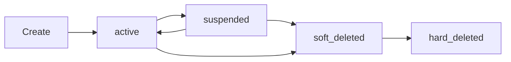

# Delegation System

Tiny Claw's delegation system enables the main agent to **spawn specialized sub-agents** for complex tasks. Sub-agents are autonomous, persistent, and can run in the background, with their results delivered when ready.

<Info>
Think of delegation like hiring temporary specialists. The main agent identifies when a task needs deep focus or specialized skills, creates a sub-agent with the right tools and context, and lets it work independently.
</Info>

## Architecture Overview

<CardGroup cols={3}>
  <Card title="Lifecycle Manager" icon="rotate">
    Create, suspend, revive, and dismiss sub-agents
  </Card>
  <Card title="Template Manager" icon="clone">
    Self-improving role templates that learn from success
  </Card>
  <Card title="Background Runner" icon="clock">
    Execute tasks asynchronously and deliver results later
  </Card>
</CardGroup>

## Why Delegation?

<AccordionGroup>
  <Accordion title="Task Specialization">
    Complex tasks benefit from focused context. A sub-agent gets a clean slate with only relevant tools and orientation.
  </Accordion>
  
  <Accordion title="Parallel Processing">
    Multiple sub-agents can work on different aspects of a problem simultaneously.
  </Accordion>
  
  <Accordion title="Background Execution">
    Long-running tasks don't block the main agent. Results are delivered when ready.
  </Accordion>
  
  <Accordion title="Memory Isolation">
    Sub-agents don't pollute the main agent's conversation history.
  </Accordion>
  
  <Accordion title="Adaptive Learning">
    Role templates improve over time based on task success rates.
  </Accordion>
</AccordionGroup>

## Sub-Agent Lifecycle

### States

```typescript packages/delegation/src/types.ts
export type SubAgentStatus = 'active' | 'suspended' | 'soft_deleted';
```

- **active** — Currently running or available for reuse
- **suspended** — Paused, can be revived for similar tasks
- **soft_deleted** — Dismissed but retained for analytics

### Record Structure

```typescript packages/delegation/src/types.ts
export interface SubAgentRecord {
  id: string;
  userId: string;
  role: string;                    // "TypeScript debugger", "API designer", etc.
  systemPrompt: string;
  toolsGranted: string[];          // Subset of main agent's tools
  tierPreference: QueryTier | null; // 'simple', 'moderate', 'complex', 'reasoning'
  status: SubAgentStatus;
  performanceScore: number;        // 0.0–1.0
  totalTasks: number;
  successfulTasks: number;
  templateId: string | null;       // Which template spawned this agent
  createdAt: number;
  lastActiveAt: number;
  deletedAt: number | null;
}
```

### State Transitions



## Lifecycle Manager

```typescript packages/delegation/src/lifecycle.ts
export interface LifecycleManager {
  create(config: {...}): SubAgentRecord;
  get(agentId: string): SubAgentRecord | null;
  listActive(userId: string): SubAgentRecord[];
  findReusable(userId: string, role: string): SubAgentRecord | null;
  
  recordTaskResult(agentId: string, success: boolean): void;
  suspend(agentId: string): void;
  dismiss(agentId: string): void;
  revive(agentId: string): SubAgentRecord | null;
  kill(agentId: string): void;
  
  cleanup(retentionMs?: number): number;
  
  getMessages(agentId: string, limit?: number): Message[];
  saveMessage(agentId: string, role: string, content: string): void;
}
```

### Creating a Sub-Agent

```typescript
const agent = lifecycle.create({
  userId: 'web:owner',
  role: 'TypeScript debugger',
  toolsGranted: ['read_file', 'search_code', 'execute_code'],
  tierPreference: 'complex',
  templateId: 'template-123',
  orientation: {
    identity: 'You are a TypeScript debugging specialist...',
    preferences: 'User prefers functional style...',
    memories: 'User had similar issue last week...',
  },
});
```

### Reusing Agents

```typescript
const existing = lifecycle.findReusable(userId, 'TypeScript debugger');

if (existing) {
  // Reuse existing agent
  const revived = lifecycle.revive(existing.id);
} else {
  // Create new agent
  const agent = lifecycle.create({...});
}
```

### Cleanup

```typescript
// Delete agents deleted more than 30 days ago
const deleted = lifecycle.cleanup(30 * 24 * 60 * 60 * 1000);
```

## Role Templates

Role templates are **self-improving blueprints** for creating sub-agents. They learn from successful delegations.

### Template Structure

```typescript packages/delegation/src/types.ts
export interface RoleTemplate {
  id: string;
  userId: string;
  name: string;                    // "TypeScript Debugger"
  roleDescription: string;         // Detailed role description
  defaultTools: string[];          // Recommended tools
  defaultTier: QueryTier | null;   // Recommended complexity tier
  timesUsed: number;
  avgPerformance: number;          // 0.0–1.0
  tags: string[];                  // ['typescript', 'debugging', 'code']
  createdAt: number;
  updatedAt: number;
}
```

### Template Manager

```typescript packages/delegation/src/templates.ts
export interface TemplateManager {
  create(config: {...}): RoleTemplate;
  findBestMatch(userId: string, taskDescription: string): RoleTemplate | null;
  update(templateId: string, updates: {...}): RoleTemplate | null;
  recordUsage(templateId: string, performanceScore: number): void;
  list(userId: string): RoleTemplate[];
  delete(templateId: string): void;
}
```

### Creating a Template

```typescript
const template = templates.create({
  userId: 'web:owner',
  name: 'TypeScript Debugger',
  roleDescription: 'Specialist in debugging TypeScript type errors and runtime issues',
  defaultTools: ['read_file', 'search_code', 'execute_code'],
  defaultTier: 'complex',
  tags: ['typescript', 'debugging', 'code'],
});
```

### Template Matching

When delegating a task, the system finds the best matching template:

```typescript
const template = templates.findBestMatch(
  userId,
  'Debug this TypeScript type error in the authentication module'
);
```

**Matching algorithm:**
1. Extract keywords from task description
2. Compute TF-IDF similarity with template tags and descriptions
3. Weight by template performance (`avgPerformance * 0.7 + similarityScore * 0.3`)
4. Return highest-scoring template above threshold (0.6)

### Learning from Results

```typescript
// After task completes
templates.recordUsage(templateId, performanceScore);

// Updates:
// - timesUsed++
// - avgPerformance = (avgPerformance * timesUsed + newScore) / (timesUsed + 1)
// - updatedAt = now
```

## Orientation Context

Sub-agents receive **orientation** — compressed context from the main agent:

```typescript packages/delegation/src/types.ts
export interface OrientationContext {
  identity: string;           // Who the main agent is
  preferences: string;        // User preferences
  memories: string;           // Relevant memories
  compactedContext?: string;  // Ultra-compact conversation summary (L0 tier, ~200 tokens)
}
```

### Building Orientation

```typescript packages/delegation/src/orientation.ts
export function buildOrientationContext(config: {
  heartwareContext: string;
  userQuery: string;
  memory: MemoryEngine;
  userId: string;
  compactedContext?: string | null;
}): OrientationContext {
  // Extract IDENTITY section from heartware
  const identity = extractSection(config.heartwareContext, 'IDENTITY');
  
  // Get relevant memories for this task
  const memories = config.memory.getContextForAgent(config.userId, config.userQuery);
  
  // Extract preferences from memories
  const preferences = extractPreferences(memories);
  
  return {
    identity: identity || 'You are a sub-agent of Tiny Claw.',
    preferences: preferences || 'No specific preferences recorded.',
    memories: memories || 'No relevant memories.',
    compactedContext: config.compactedContext || undefined,
  };
}
```

## Background Runner

Long-running tasks can execute in the background and deliver results later.

### Background Task Record

```typescript packages/delegation/src/types.ts
export interface BackgroundTaskRecord {
  id: string;
  userId: string;
  agentId: string;
  taskDescription: string;
  status: 'running' | 'completed' | 'failed' | 'delivered';
  result: string | null;
  startedAt: number;
  completedAt: number | null;
  deliveredAt: number | null;
}
```

### Starting a Background Task

```typescript packages/delegation/src/background.ts
const taskId = background.start({
  userId: 'web:owner',
  agentId: agent.id,
  task: 'Research best practices for TypeScript error handling',
  provider: complexProvider,
  tools: agent.toolsGranted,
  orientation: orientationContext,
  templateId: template?.id,
});
```

**The task runs in a separate execution context:**
1. Sub-agent loop executes independently
2. Results are saved to database when complete
3. Main agent continues serving other requests
4. User receives notification when task finishes

### Checking Status

```typescript
const undelivered = background.getUndelivered(userId);

for (const task of undelivered) {
  console.log(`Task ${task.id}: ${task.status}`);
  if (task.status === 'completed') {
    console.log(`Result: ${task.result}`);
    background.markDelivered(task.id);
  }
}
```

### Delivery Flow

<Steps>
  <Step title="Task Completes">
    Background runner saves result to database with status = 'completed'
  </Step>
  <Step title="Next User Message">
    Main agent checks for undelivered tasks via `background.getUndelivered(userId)`
  </Step>
  <Step title="Inject Results">
    Task results are injected into system prompt: "While you were away, sub-agent X completed task Y with result Z."
  </Step>
  <Step title="Mark Delivered">
    After injecting, `background.markDelivered(taskId)` updates status to 'delivered'
  </Step>
</Steps>

## Delegation Tools

The main agent uses these tools to manage sub-agents:

<AccordionGroup>
  <Accordion title="delegate_task">
    Create a sub-agent for a specific task
    
    ```typescript
    {
      name: 'delegate_task',
      description: 'Delegate a complex task to a specialized sub-agent',
      parameters: {
        type: 'object',
        properties: {
          task: { type: 'string' },
          role: { type: 'string' },
          tools: { type: 'array', items: { type: 'string' } },
          background: { type: 'boolean' },
        },
        required: ['task', 'role'],
      },
    }
    ```
  </Accordion>
  
  <Accordion title="delegate_to_existing">
    Reuse an existing sub-agent
    
    ```typescript
    {
      name: 'delegate_to_existing',
      description: 'Delegate to an existing sub-agent by ID',
      parameters: {
        type: 'object',
        properties: {
          agentId: { type: 'string' },
          task: { type: 'string' },
        },
        required: ['agentId', 'task'],
      },
    }
    ```
  </Accordion>
  
  <Accordion title="list_sub_agents">
    List all active sub-agents
    
    ```typescript
    {
      name: 'list_sub_agents',
      description: 'List all active sub-agents',
      parameters: { type: 'object', properties: {} },
    }
    ```
  </Accordion>
  
  <Accordion title="manage_sub_agent">
    Suspend, revive, or dismiss a sub-agent
    
    ```typescript
    {
      name: 'manage_sub_agent',
      description: 'Manage sub-agent lifecycle (suspend/revive/dismiss)',
      parameters: {
        type: 'object',
        properties: {
          agentId: { type: 'string' },
          action: { type: 'string', enum: ['suspend', 'revive', 'dismiss'] },
        },
        required: ['agentId', 'action'],
      },
    }
    ```
  </Accordion>
</AccordionGroup>

## Adaptive Timeout Estimation

Delegation v3 includes an **adaptive timeout estimator** that learns from historical task performance:

```typescript packages/delegation/src/timeout-estimator.ts
export interface TimeoutEstimate {
  initialMs: number;        // Starting timeout
  minMs: number;            // Minimum timeout
  maxMs: number;            // Maximum timeout
  confidence: number;       // 0.0–1.0
  extensionAllowed: boolean; // Can extend during execution
}

export interface TimeoutEstimator {
  estimate(taskType: string, tier: string): TimeoutEstimate;
  recordMetric(metric: TaskMetricRecord): void;
  shouldExtend(taskId: string, elapsed: number): ExtensionDecision;
}
```

### Learning from History

```typescript
const estimate = estimator.estimate('code_review', 'complex');

// Returns:
// {
//   initialMs: 120000,      // 2 minutes (based on p75 of historical data)
//   minMs: 60000,           // 1 minute
//   maxMs: 300000,          // 5 minutes
//   confidence: 0.85,       // High confidence (many samples)
//   extensionAllowed: true, // Can extend if needed
// }
```

### Dynamic Extension

```typescript
// During execution, check if extension is needed
const decision = estimator.shouldExtend(taskId, elapsedMs);

if (decision.shouldExtend) {
  newTimeout = decision.newTimeoutMs;
  console.log(`Extending timeout by ${decision.extensionMs}ms`);
}
```

## Blackboard Collaboration (v3)

Multiple sub-agents can collaborate on complex problems using a **blackboard architecture**:

```typescript packages/delegation/src/blackboard.ts
export interface BlackboardProblem {
  id: string;
  userId: string;
  problemText: string;
  status: 'open' | 'resolved';
  synthesis: string | null;
  createdAt: number;
}

export interface Blackboard {
  postProblem(userId: string, problemText: string): string;
  postProposal(problemId: string, agentId: string, agentRole: string, proposal: string, confidence: number): void;
  getProposals(problemId: string): BlackboardEntry[];
  resolve(problemId: string, synthesis: string): void;
}
```

### Workflow

<Steps>
  <Step title="Post Problem">
    Main agent posts a complex problem to the blackboard
  </Step>
  <Step title="Spawn Specialists">
    Multiple sub-agents are created with different specializations
  </Step>
  <Step title="Post Proposals">
    Each sub-agent analyzes and posts its proposal with confidence score
  </Step>
  <Step title="Synthesize">
    Main agent reads all proposals and synthesizes a final solution
  </Step>
  <Step title="Resolve">
    Main agent marks problem as resolved with synthesis
  </Step>
</Steps>

## Performance Tracking

Task metrics are recorded for adaptive learning:

```typescript packages/types/src/index.ts
export interface TaskMetricRecord {
  id: string;
  userId: string;
  taskType: string;        // 'code_review', 'debugging', 'research', etc.
  tier: string;            // 'simple', 'moderate', 'complex', 'reasoning'
  durationMs: number;
  iterations: number;
  success: boolean;
  createdAt: number;
}
```

### Recording Metrics

```typescript
db.saveTaskMetric({
  id: crypto.randomUUID(),
  userId: 'web:owner',
  taskType: 'code_review',
  tier: 'complex',
  durationMs: 145000,
  iterations: 8,
  success: true,
  createdAt: Date.now(),
});
```

### Analyzing Performance

```typescript
const metrics = db.getTaskMetrics('code_review', 'complex', 100);

const avgDuration = metrics.reduce((sum, m) => sum + m.durationMs, 0) / metrics.length;
const successRate = metrics.filter(m => m.success).length / metrics.length;

console.log(`Average duration: ${avgDuration}ms`);
console.log(`Success rate: ${(successRate * 100).toFixed(1)}%`);
```

## Delegation Handbook

The system includes a built-in handbook with best practices:

```typescript packages/delegation/src/handbook.ts
export const DELEGATION_HANDBOOK = `
# Delegation Best Practices

## When to Delegate

- Task requires deep focus or multiple iterations
- Task benefits from specialized context
- Task is long-running (>2 minutes)
- Task is independent from current conversation

## Choosing Tools

- Grant minimum necessary tools (principle of least privilege)
- Common combinations:
  - Code review: read_file, search_code
  - Debugging: read_file, execute_code
  - Research: web_fetch, web_search
  - Writing: read_file, heartware_write

## Role Descriptions

Be specific:
- ✅ "TypeScript type error debugger for authentication modules"
- ❌ "Helper agent"

## Background vs Foreground

- Background: Research, long analysis, batch processing
- Foreground: Quick tasks, user waiting for result
`;
```

<Card title="Next: Smart Routing" icon="route" href="/concepts/smart-routing">
  Learn about 8-dimension query classification
</Card>