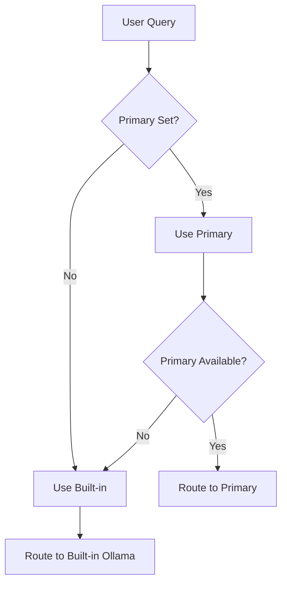

Tiny Claw uses a **smart router** with a two-tier provider system. This guide covers managing providers, switching models, and optimizing query routing.

## Provider Architecture

<CardGroup cols={2}>
  <Card title="Built-in Provider" icon="cloud">
    **Ollama Cloud** — Free fallback, always available. Configured during setup and serves as the ultimate fallback.
  </Card>
  
  <Card title="Primary Provider" icon="star">
    **Plugin Provider** — Optional override (OpenAI, Anthropic, etc.). When set, becomes the default provider in the smart router.
  </Card>
</CardGroup>

### Provider Hierarchy

The smart router selects providers based on availability and query complexity:



<Note>
The built-in Ollama Cloud provider is **always available** as a fallback, even if the primary provider is unreachable.
</Note>

## Provider Registry

All providers (built-in + plugins) are registered in the **provider registry** during agent boot:

```typescript
// Registry example structure
providers: {
  'ollama': OllamaProvider,      // Built-in, always registered
  'openai': OpenAIProvider,       // Plugin, if installed
  'anthropic': AnthropicProvider, // Plugin, if installed
}
```

### Listing Providers

Ask your agent to show all registered providers:

```
"List my providers"
"What LLM providers do I have?"
```

The agent will report:
- Provider ID
- Model name
- Availability status
- Configuration (base URL, API key reference)

## Managing Built-in Provider

The built-in Ollama Cloud provider is configured during setup but can be modified later.

### View Current Model

<CodeGroup>
```bash CLI
$ tinyclaw config model

Model Configuration

Built-in (Ollama Cloud - always available as fallback)
  Model    : qwen2.5:32b-instruct
  Base URL : https://ollama.com/api
```

```text Conversational
"What model are you using?"
"Show my current configuration"
```
</CodeGroup>

### Switch Built-in Model

Change the built-in model to optimize for speed or capability:

<Tabs>
  <Tab title="Via CLI">
    ```bash
    tinyclaw config model builtin <tag>
    ```
    
    Available models:
    - `qwen2.5:32b-instruct` — Balanced (default)
    - `qwen2.5:14b-instruct` — Fast, smaller
    - `qwen2.5:72b-instruct` — Most capable, slower
  </Tab>
  
  <Tab title="Via Conversation">
    ```
    "Switch to the faster Ollama model"
    "Use the 72B model for better reasoning"
    ```
    
    The agent will update the config and restart if needed.
  </Tab>
</Tabs>

<Warning>
Model changes require restarting the agent with `tinyclaw start` to take effect.
</Warning>

## Managing Primary Provider

The primary provider is an optional override that takes precedence over the built-in provider.

### Setting Primary Provider

Install a provider plugin and set it as primary:

<Steps>
<Step title="Install provider plugin">
  ```bash
  # Example: OpenAI provider plugin
  # Installation command varies by plugin distribution
  ```
</Step>

<Step title="Configure API key">
  Store the provider's API key securely:
  
  <Tabs>
    <Tab title="Via Conversation">
      ```
      "I want to use OpenAI. My API key is sk-..."
      "Add my Anthropic API key: sk-ant-..."
      ```
    </Tab>
    
    <Tab title="Via Setup Wizard">
      If the plugin requires setup, the agent will prompt you during boot:
      
      ```bash
      $ tinyclaw start
      
      ⚠️  OpenAI provider detected but not configured.
      Enter your OpenAI API key:
      › sk-••••••••••••••••••••
      
      ✔ OpenAI provider configured
      ```
    </Tab>
  </Tabs>
</Step>

<Step title="Set as primary">
  Tell your agent to prioritize this provider:
  
  ```
  "Set OpenAI as my primary provider"
  "Make Anthropic my default model"
  ```
  
  The agent will update the config:
  
  ```typescript
  providers.primary = {
    model: 'gpt-4',
    baseUrl: 'https://api.openai.com/v1',
    apiKeyRef: 'provider:openai'
  }
  ```
</Step>
</Steps>

### Viewing Primary Provider

<CodeGroup>
```bash CLI
$ tinyclaw config model primary

Primary Provider

  Model      : gpt-4
  Base URL   : https://api.openai.com/v1
  API Key    : stored as "provider:openai"

Clear with: tinyclaw config model primary clear
```

```text Conversational
"What's my primary provider?"
"Show me my default model"
```
</CodeGroup>

### Clearing Primary Provider

Revert to using only the built-in provider:

<Tabs>
  <Tab title="Via CLI">
    ```bash
    tinyclaw config model primary clear
    ```
  </Tab>
  
  <Tab title="Via Conversation">
    ```
    "Clear my primary provider"
    "Go back to using only Ollama"
    ```
  </Tab>
</Tabs>

## Smart Router

The smart router automatically selects the best provider for each query based on **complexity tiers**.

### Query Complexity Tiers

<CardGroup cols={2}>
  <Card title="Simple" icon="1">
    Quick lookups, greetings, simple facts
  </Card>
  <Card title="Moderate" icon="2">
    General questions, basic reasoning
  </Card>
  <Card title="Complex" icon="3">
    Multi-step tasks, analysis, code generation
  </Card>
  <Card title="Reasoning" icon="4">
    Deep reasoning, chain-of-thought, complex logic
  </Card>
</CardGroup>

### Tier-Based Routing

The router uses **tier mappings** to assign providers:

```typescript
tierMapping: {
  simple: 'ollama',      // Fast, cheap model for simple queries
  moderate: 'ollama',    // Still using built-in
  complex: 'openai',     // Route complex queries to primary
  reasoning: 'openai'    // Use best model for reasoning
}
```

### Automatic Fallback

If a provider is unavailable, the router **falls down through tiers**:

<Steps>
<Step title="Try assigned provider">
  Attempt to use the provider mapped to this tier.
</Step>

<Step title="Fallback through tiers">
  If unavailable, try the next lower tier's provider:
  
  `reasoning` → `complex` → `moderate` → `simple`
</Step>

<Step title="Ultimate fallback">
  If all tiers fail, use the built-in Ollama provider.
</Step>
</Steps>

This ensures **queries always get answered**, even during provider outages.

### Configuring Tier Mapping

Customize which provider handles each tier:

```
"Use OpenAI for complex queries"
"Route reasoning tasks to Anthropic"
"Make Ollama handle everything simple and moderate"
```

The agent will update the tier mapping in the config engine.

## Provider Plugins

### Available Provider Plugins

<CardGroup cols={2}>
  <Card title="OpenAI" icon="openai">
    - GPT-4, GPT-4 Turbo, GPT-3.5
    - Function calling support
    - High rate limits
  </Card>
  
  <Card title="Anthropic" icon="robot">
    - Claude 3 (Opus, Sonnet, Haiku)
    - Extended context windows
    - Strong reasoning capabilities
  </Card>
  
  <Card title="Ollama Local" icon="server">
    - Run models on your own hardware
    - Fully private, no API calls
    - Supports Llama, Mistral, etc.
  </Card>
  
  <Card title="Custom" icon="code">
    - Build your own provider plugin
    - Compatible with any OpenAI-compatible API
    - Full control over routing
  </Card>
</CardGroup>

### Installing Provider Plugins

Provider plugins are installed separately:

```bash
# Example installation (command varies by plugin)
# Check plugin documentation for exact steps
```

Once installed, the plugin is automatically detected during agent boot.

### Provider Configuration

Each provider plugin may have unique settings:

<AccordionGroup>
  <Accordion title="OpenAI Settings" icon="openai">
    - **API Key**: Required for authentication
    - **Organization ID**: Optional, for team accounts
    - **Model**: `gpt-4`, `gpt-4-turbo`, `gpt-3.5-turbo`, etc.
    - **Base URL**: Override for Azure OpenAI or compatible APIs
    - **Max Tokens**: Limit response length
  </Accordion>
  
  <Accordion title="Anthropic Settings" icon="robot">
    - **API Key**: Required for authentication
    - **Model**: `claude-3-opus`, `claude-3-sonnet`, `claude-3-haiku`
    - **Max Tokens**: Context window limit
    - **Version**: API version (default: latest)
  </Accordion>
  
  <Accordion title="Ollama Local Settings" icon="server">
    - **Base URL**: Local Ollama server URL (e.g., `http://localhost:11434`)
    - **Model**: Any model installed locally (`llama3`, `mistral`, etc.)
    - **Keep Alive**: Keep model loaded in memory
    - **Num GPU**: Number of GPU layers to use
  </Accordion>
</AccordionGroup>

## Provider Health Monitoring

### Checking Provider Status

Ask your agent about provider health:

```
"Are all my providers working?"
"Check if OpenAI is available"
"Provider status report"
```

The agent will test connectivity and report:
- ✅ Available
- ⚠️ Slow/degraded
- ❌ Unreachable

### Automatic Health Checks

The smart router performs periodic health checks:

- **Interval**: Every 60 seconds (configurable)
- **Timeout**: 5 seconds per provider
- **Fallback**: Automatic if provider fails 3 consecutive checks

You can view health history:

```
"Show my provider uptime"
"When was OpenAI last unreachable?"
```

## Cost Optimization

### Model Selection Strategy

Use cheaper models for simple tasks, expensive models for complex reasoning:

<Steps>
<Step title="Set tier thresholds">
  ```
  "Use GPT-3.5 for simple and moderate queries"
  "Only use GPT-4 for complex reasoning"
  ```
</Step>

<Step title="Monitor usage">
  ```
  "How many tokens did I use today?"
  "What's my estimated cost this month?"
  ```
</Step>

<Step title="Adjust as needed">
  If costs are high, route more queries to Ollama (free):
  
  ```
  "Make Ollama handle complex queries too"
  ```
</Step>
</Steps>

### Provider Cost Comparison

| Provider | Model | Cost per 1M tokens | Best for |
|----------|-------|-------------------|----------|
| Ollama Cloud | qwen2.5:32b | Free (rate limited) | General use |
| OpenAI | GPT-3.5 Turbo | $0.50 / $1.50 | Simple/moderate |
| OpenAI | GPT-4 Turbo | $10 / $30 | Complex reasoning |
| Anthropic | Claude 3 Haiku | $0.25 / $1.25 | Fast, affordable |
| Anthropic | Claude 3 Opus | $15 / $75 | Best quality |
| Ollama Local | Self-hosted | Free (hardware cost) | Privacy, control |

<Note>
Prices are approximate and subject to change. Check provider pricing pages for current rates.
</Note>

## Troubleshooting Providers

### Provider Not Available

<Steps>
<Step title="Check API key">
  Verify the key is stored and valid:
  
  ```
  "Show my OpenAI API key"
  ```
  
  Re-enter if needed:
  
  ```
  "Update my OpenAI API key"
  ```
</Step>

<Step title="Test connectivity">
  ```
  "Test my OpenAI connection"
  ```
  
  The agent will attempt a health check and report errors.
</Step>

<Step title="Check logs">
  ```bash
  tinyclaw start --verbose
  ```
  
  Look for provider initialization and connection errors.
</Step>
</Steps>

### Slow Responses

<AccordionGroup>
  <Accordion title="Model is overloaded" icon="gauge-high">
    Switch to a faster model or different provider:
    
    ```
    "Switch to GPT-3.5 for faster responses"
    ```
  </Accordion>
  
  <Accordion title="Network latency" icon="wifi">
    Check your internet connection. Consider using a local Ollama instance for zero-latency responses.
  </Accordion>
  
  <Accordion title="Rate limiting" icon="timer">
    You may be hitting provider rate limits. Upgrade your plan or spread queries across multiple providers.
  </Accordion>
</AccordionGroup>

### Fallback Not Working

<Steps>
<Step title="Verify built-in is configured">
  ```bash
  tinyclaw config model
  ```
  
  Ensure Ollama Cloud is set up with a valid API key.
</Step>

<Step title="Check fallback logic">
  Review tier mappings:
  
  ```
  "Show my provider tier mapping"
  ```
  
  Ensure there's a fallback path from higher to lower tiers.
</Step>

<Step title="Test fallback manually">
  Temporarily disable the primary provider and verify fallback:
  
  ```
  "Disable OpenAI provider"
  "What's 2+2?"  # Should fall back to Ollama
  "Enable OpenAI provider"
  ```
</Step>
</Steps>

<Card title="Next Steps" icon="arrow-right" href="/concepts/smart-routing">
  Deep dive into smart router architecture and query classification
</Card>
